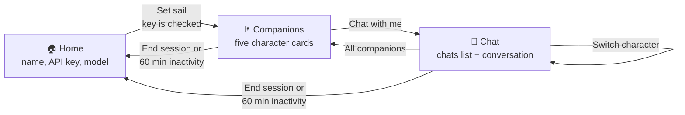
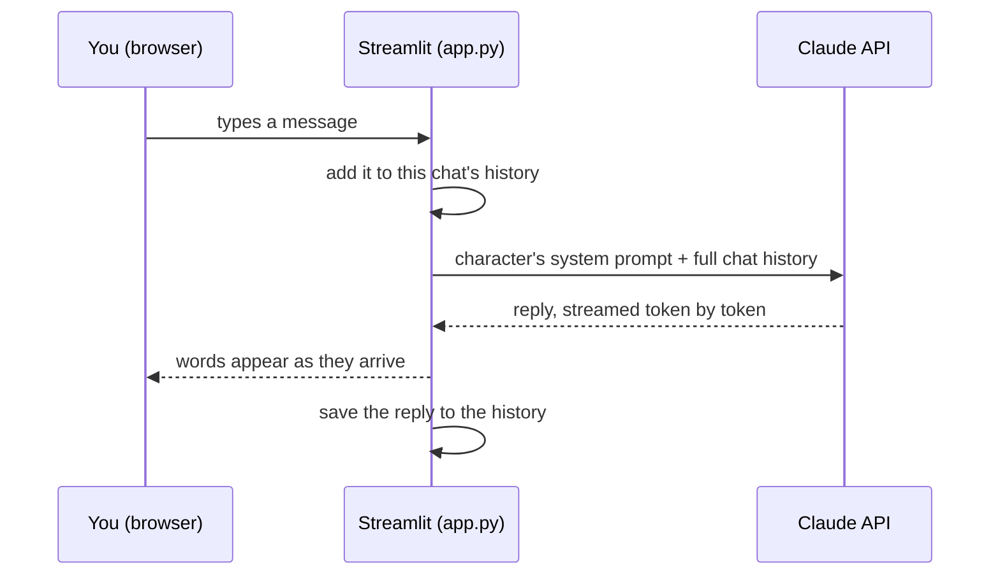

# 🐌 Den Den Chat

**Ring up a Straw Hat crewmate for food, fitness, code, money and stories.**

> ✨ **Vibe-coded from start to finish:** I described what I wanted, and AI built it. See [how it was built](#built-with-vibe-coding).

Den Den Chat is a chatbot with five One Piece–inspired personalities, built with [Streamlit](https://streamlit.io) and powered by [Claude](https://www.anthropic.com/claude). It's named after the *Den Den Mushi*, the snail phones the crew use to call each other.

> **Live app:** _add your Streamlit Cloud link here after deploying_

| | Companion | Role | Personality |
|---|---|---|---|
| 🥗 | **Sanji** | Dietician | Suave cook who never lets anyone go hungry |
| 🏋️ | **Zoro** | Fitness trainer | Gruff, no excuses, terrible sense of direction |
| 💻 | **Vegapunk** | Coding teacher | Excitable genius who explains things simply |
| 💰 | **Nami** | Financial educator | Hates wasted money, jokes about charging interest |
| 📖 | **Usopp** | Storyteller | "Captain Usopp", commander of 8,000 followers (allegedly) |

---

## Contents

- [Quick start](#quick-start)
- [What is Streamlit?](#what-is-streamlit)
- [How the app works](#how-the-app-works)
- [Project structure](#project-structure)
- [Privacy: bring your own key](#privacy-bring-your-own-key)
- [Deploy to Streamlit Community Cloud](#deploy-to-streamlit-community-cloud)
- [Customise it](#customise-it)
- [Built with vibe coding](#built-with-vibe-coding)
- [Cost and limitations](#cost-and-limitations)

---

## Quick start

You need Python 3.10+ and an Anthropic API key (create one at [console.anthropic.com](https://console.anthropic.com) → **API Keys**).

```bash
git clone <your-repo-url>
cd Chatbot-Personalities

# Create and activate a virtual environment
python -m venv .venv
.venv\Scripts\activate          # Windows
# source .venv/bin/activate     # macOS / Linux

pip install -r requirements.txt
streamlit run app.py
```

The app opens at **http://localhost:8501**. Paste your API key, click **Set sail**, pick a companion and start chatting.

---

## What is Streamlit?

[Streamlit](https://streamlit.io) is a Python library that turns a Python script into a web app. You write ordinary Python, and Streamlit draws the page in the browser.

```python
import streamlit as st

name = st.text_input("Your name")
if st.button("Say hi"):
    st.write(f"Ahoy, {name}!")
```

Those four lines give you a working web page with a text box and a button. There is no HTML, CSS or JavaScript, and no separate backend.

### What it replaces

A typical web app needs several pieces. Streamlit covers all of them:

| Normally you'd build | With Streamlit |
|---|---|
| A frontend (HTML/CSS/React) | `st.title`, `st.button`, `st.chat_input` and friends draw the UI |
| A backend API (Flask, FastAPI, Express) | Streamlit runs the web server for you |
| The connection between them (REST, websockets) | Built in |
| Per-user session storage | `st.session_state` |
| A design system | A theme file: `.streamlit/config.toml` |

### The one idea you need: the script reruns

This is the key to understanding any Streamlit app:

> **Every time a user interacts with the page — clicks a button, types a message — Streamlit runs your whole script again from top to bottom.**

So how does anything stick around between runs? With **`st.session_state`**, a dictionary that survives reruns and is separate for each browser tab. In this app it holds the API key, the current screen, and every chat.

```
User clicks "Chat with me"
      │
      ▼
Callback runs:  st.session_state.view = "chat"
      │
      ▼
Script reruns from the top → reads view == "chat" → draws the chat screen
```

---

## How the app works

### The three screens



1. **Home:** a centred card. The setup form is on the left: your name (optional), your Anthropic API key and the model. An explanation of the app is on the right. When you click **Set sail**, the key is checked with a free API call before the session starts.
2. **Companions:** one card per character, showing their emblem, role, a short bio and a **Chat with me** button.
3. **Chat:** the left side lists your chats with this character, so you can start a **new chat**, reopen an old one or delete it. The open conversation is on the right, with **Switch character** and **End conversation** at the top.

### What happens when you send a message



- The model has no memory of its own, so **the whole conversation is sent with every message**. That's how each character remembers what you said earlier.
- The reply is **streamed** with `client.messages.stream(...)` and `st.write_stream(...)`, so text appears as it is written instead of all at once.
- If the call fails (bad key, rate limit, network), your unanswered message is removed and a friendly error is shown.

### Where each character's personality comes from

Each character is one entry in the `CHARACTERS` dictionary in `app.py`. The personality lives in its **system prompt**, which is sent to Claude with every request and has three parts:

| Section | Purpose | Example (Zoro) |
|---|---|---|
| **Your voice** | Personality, kept to a line or two per reply | "Gruff, blunt, few words… terrible sense of direction" |
| **How you work** | What to ask first, how to answer | "Give concrete plans: exercise names, sets, reps, rest" |
| **Where you stop** | When to hand off to a real professional | "Pain, injuries, heart conditions → see a professional" |

The advice-giving characters (diet, fitness, money) explain and educate. They don't diagnose, prescribe, or tell you what to buy.

### What's kept in the session

Everything lives in `st.session_state`, in memory only:

```python
{
    "view": "chat",                  # which screen to show: home / companions / chat
    "api_key": "sk-ant-…",           # never written to disk or logged
    "model": "claude-haiku-4-5-20251001",
    "user_name": "Luffy",
    "active": "Storyteller",         # the character you're talking to
    "expires_at": 1758700000.0,      # session ends after 60 min of inactivity
    "chats": {                       # each character has their own list of chats
        "Storyteller": [
            {"id": 3, "title": "A noir mystery in a tech park…", "messages": [...]},
            {"id": 1, "title": "A shy dragon bedtime story", "messages": [...]},
        ],
        ...
    },
    "current": {"Storyteller": 3},   # which chat is open for each character
}
```

---

## Project structure

```
Chatbot-Personalities/
├── app.py                     # The whole app: characters, screens, Claude calls
├── requirements.txt           # streamlit + anthropic
├── .streamlit/
│   └── config.toml            # Theme: colours, fonts, rounded corners
└── assets/
    ├── art/                   # Original SVG emblems + home banner
    │   ├── banner.svg
    │   └── sanji.svg, zoro.svg, vegapunk.svg, nami.svg, usopp.svg
    └── characters/            # Optional: drop your own portraits here
        └── README.md
```

`app.py` is arranged top to bottom:

| Part | What it does |
|---|---|
| `APP_NAME`, `SESSION_MINUTES` | Settings you might want to change |
| `CHARACTERS` | The five companions: name, colour, bio, examples, system prompt |
| `MODELS` | The models you can pick on the home page |
| Session helpers | `init_state`, `end_session`, `new_chat`, `current_chat`, `delete_chat`, … |
| `home_view()` | The centred card with the setup form |
| `companions_view()` | The grid of character cards |
| `chat_view()` | The chats list and the conversation, including the Claude call |
| Last line | Picks which screen to draw from `st.session_state.view` |

---

## Privacy: bring your own key

- Each visitor pastes **their own** Anthropic API key, so whoever hosts the app pays nothing for other people's chats.
- The key is kept in memory for that browser session only. It's **never saved to disk, logged, or sent anywhere except Anthropic's API**.
- Chats are wiped when you click **End session**, refresh the page, close the tab, or after **60 minutes of inactivity**.
- Everything is in `app.py`, so you can read it and check.

---

## Deploy to Streamlit Community Cloud

[Streamlit Community Cloud](https://streamlit.io/cloud) hosts Streamlit apps for free, straight from a GitHub repo.

### 1. Push the code to GitHub

Create an empty repository on GitHub (no README, no .gitignore — this project already has them). Then, from the project folder:

```bash
git remote add origin https://github.com/<your-username>/<your-repo>.git
git branch -M main
git push -u origin main
```

### 2. Deploy

1. Go to **[share.streamlit.io](https://share.streamlit.io)** and sign in with GitHub.
2. Allow Streamlit to access your repositories when asked.
3. Click **Create app** → **Deploy a public app from GitHub**.
4. Fill in:
   - **Repository:** `<your-username>/<your-repo>`
   - **Branch:** `main`
   - **Main file path:** `app.py`
   - **App URL:** pick a subdomain, e.g. `den-den-chat`
5. Optional: under **Advanced settings**, choose a Python version (3.12 or 3.13).
6. Click **Deploy**. The first build takes a few minutes while it installs `requirements.txt`.

**No secrets are needed**, because every user brings their own key.

### 3. Updating the app

Every `git push` to `main` redeploys the app automatically.

```bash
git add .
git commit -m "Describe your change"
git push
```

---

## Customise it

### Add a companion

Add one entry to `CHARACTERS` in `app.py`. The cards, chat and home page pick it up automatically.

```python
"Music Teacher": {
    "name": "Brook",
    "color": "gray",               # red, orange, yellow, green, blue, violet or gray
    "emoji": "🎻",
    "tagline": "Yohohoho! Let's make music",
    "bio": "A gentleman musician ... (two lines for the card)",
    "examples": ["How do I start learning the violin?", "Explain chords simply"],
    "prompt": """You are Brook, ...

Your voice:
- ...

How you work:
- ...

Where you stop:
- ...""",
},
```

For an emblem, add `assets/art/brook.svg`. You can also drop a portrait in `assets/characters/brook.png`, which takes priority. The file name is the character's name in lowercase.

### Change the look

Edit `.streamlit/config.toml`. For example, `primaryColor` sets the button colour, `backgroundColor` the page, and `headingFont` / `font` the fonts. Save the file and refresh the page.

### Other settings in `app.py`

- `APP_NAME` / `APP_TAGLINE`: the title and subtitle.
- `SESSION_MINUTES`: how long an idle session lasts.
- `MODELS`: which Claude models appear in the dropdown.

---

## Built with vibe coding

This project was built by **vibe coding**: describing what I wanted in plain English to an AI coding assistant ([Claude Code](https://claude.com/claude-code)) and steering the result, instead of writing every line by hand. The term was coined by Andrej Karpathy in 2025.

### How this app came together

Each step was a short request, followed by checking the result and asking for changes:

1. **"Help me understand the project."** The assistant read the code and explained how it worked.
2. **"Use One Piece character names."** The personas were renamed, then given each character's voice.
3. **"Home page as a centred card, config form on the left, explanation on the right, character cards, then a chat page."** The three-screen layout was built.
4. **"Make it colourful, suggest a better name."** This added the theme and original artwork, and the name *Den Den Chat* was chosen from a list of ideas.
5. **"The left side should show multiple chat sessions, not the characters."** The chat page was reworked around sessions.
6. **"Help me deploy and write a complete README."** That produced this document.

### Tips if you want to try it

- **Describe the outcome, not the code.** Something like "a centred card with the form on the left" works better than naming widgets.
- **Go one step at a time.** Build, look, adjust. Small requests are easier to check than one giant one.
- **Share screenshots.** Pointing at the real screen ("this left panel should…") is the fastest way to explain a change.
- **Ask it to explain.** "Help me understand this" turns vibe coding into learning.
- **Still review and test.** The AI can be confidently wrong. Run the app, click through every screen, and read anything security-related (like how the API key is handled) yourself.
- **Commit often**, so you can always go back to a version that worked.

---

## Cost and limitations

**Cost:** whoever's key is used pays for their own messages. Haiku 4.5 (the default) is the cheapest option, and a typical chat costs a fraction of a cent. See [Anthropic's pricing](https://www.anthropic.com/pricing) for current rates, and set a monthly spend limit in the [Anthropic console](https://console.anthropic.com).

**Limitations:**
- Chats are **not saved** between visits. That's deliberate, for privacy.
- The full conversation is sent with every message, so very long chats cost more per message.
- Replies are capped at about 2,000 tokens, which may cut off very long stories.
- Community Cloud is fine for personal use and small groups, not heavy traffic.

---

## Stack

Python · [Streamlit](https://streamlit.io) · [Anthropic Python SDK](https://github.com/anthropics/anthropic-sdk-python) · Claude

---

*Den Den Chat is a fan project and is not affiliated with or endorsed by Eiichiro Oda, Shueisha, Toei Animation or the One Piece franchise. All artwork in this repo is original.*
